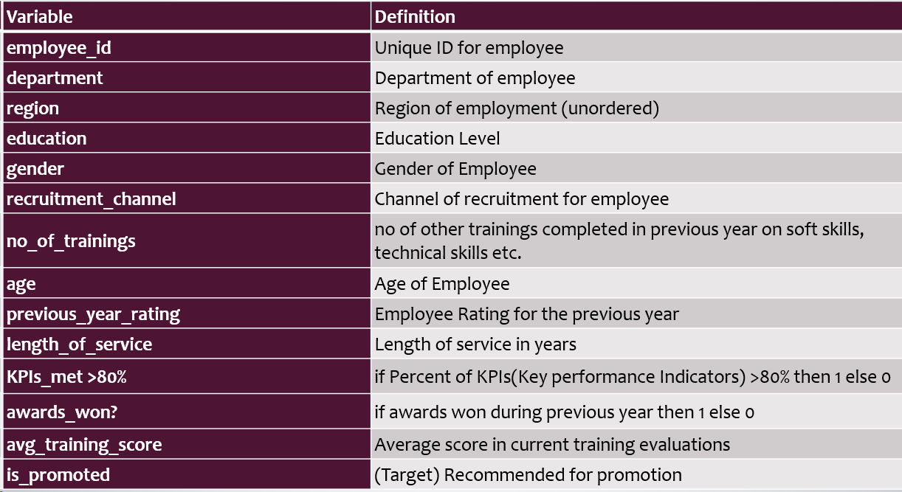
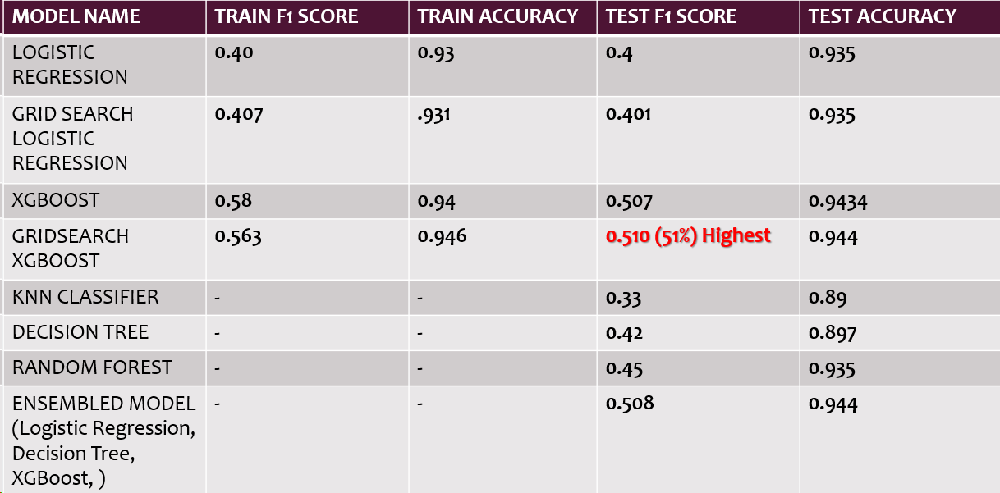

# HR-Analytics
The aim of this project is to develop a Machine Learning model to predict the employees in a firm who are most likely to be promoted based on their previous performance and other various company specific attributes.

## Problem Statement

Your client is a large MNC and they have 9 broad verticals across the organisation. One of the problem your client is facing is around identifying the right people for promotion (only for manager position and below) and prepare them in time. Currently the process, they are following is:
1.	They first identify a set of employees based on recommendations/ past performance
2.	Selected employees go through the separate training and evaluation program for each vertical. These programs are based on the required skill of each vertical
3.	At the end of the program, based on various factors such as training performance, KPI completion (only employees with KPIs completed greater than 60% are considered) etc., employee gets promotion
For above mentioned process, the final promotions are only announced after the evaluation and this leads to delay in transition to their new roles. Hence, company needs your help in identifying the eligible candidates at a particular checkpoint so that they can expedite the entire promotion cycle.  
They have provided multiple attributes around Employee's past and current performance along with demographics. Now, The task is to predict whether a potential promotee at checkpoint in the test set will be promoted or not after the evaluation process.

## Dataset Description

## Tools and Libraries Used :
1. Jupyter Notebook
2. Pandas Library (for Data Manipulation)
3. sklearn
4. Seaborn
5. MatplotLib

## Results 

## Conclusion
- The model that I selected for test data prediction is XG-Boost with GridSearchCV, which had the highest F1-Score of 0.510 (51%). Since the Performance Metric mentioned in the    Problem-Statement is F1-Score.
- Hence, as per the predictions of my model out of 23490 deserving candidates for promotion in the TestData.csv, a total of 728 employees are actually fit for receiving the        promotion from their current role in the organization.
